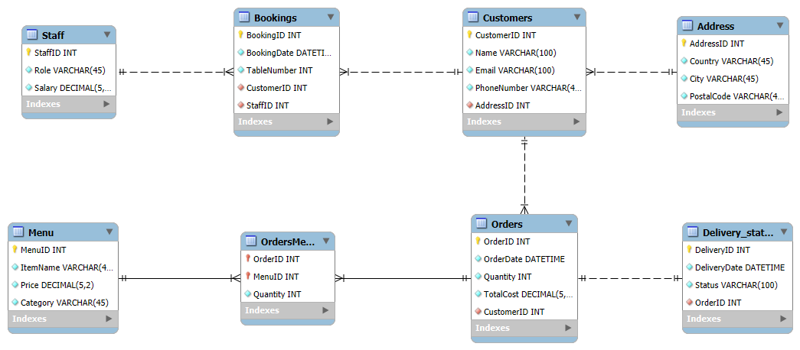
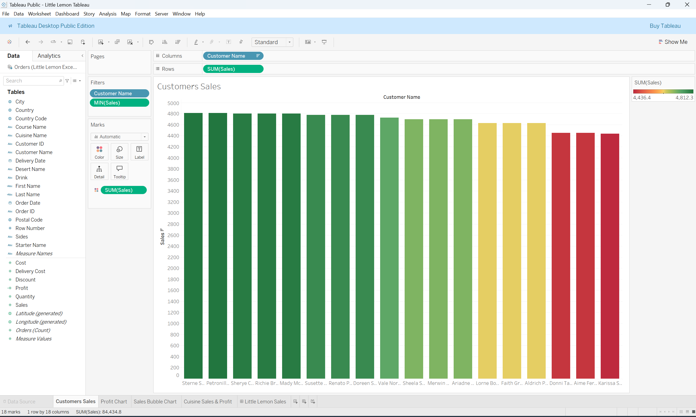
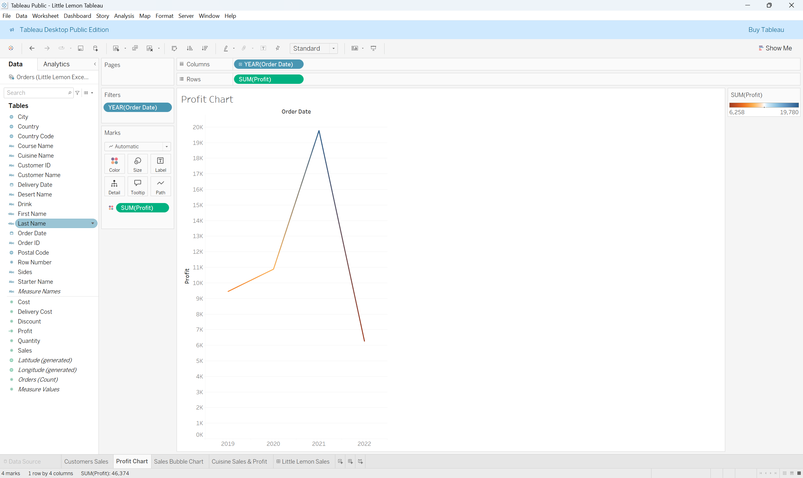
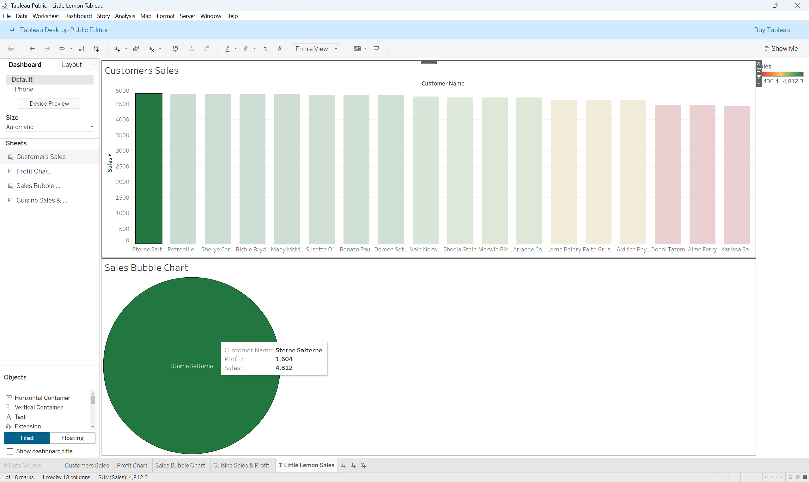

# Little Lemon Restaurant Booking System - Database Project

## Overview

This project focuses on developing a comprehensive booking system for Little Lemon, a restaurant. The primary goal is to design and implement a robust relational database in MySQL capable of managing booking information, customer details, and related operational data. This system will allow Little Lemon to efficiently handle customer reservations, track booking statuses, and analyze booking trends.

This project was completed by following video lectures and prescribed readings, covering the creation of database components, Python client interaction, stored procedure implementation, and data reporting using Tableau.

## Project Structure

The project involved the following key actions and deliverables:

1.  **Database Design and Implementation:**
    *   Creating an Entity-Relationship (ER) Diagram for the booking system.
    *   Generating the Database Schema in MySQL.
    *   Populating the database with sample booking data.
2.  **Stored Procedure Implementation:**
    *   Developing SQL stored procedures to manage booking data and perform common operations.
3.  **Python Database Interaction:**
    *   Connecting to the MySQL database using a Python client.
    *   Utilizing Python to interact with the database, potentially for invoking procedures or querying data.
4.  **Tableau Data Analysis and Reporting:**
    *   Connecting Tableau to the MySQL database.
    *   Generating data reports and dashboards to visualize booking data.

## Deliverables Included

*   **ER Diagram:** A PNG file showing the connections between the tables in the booking system (`er_diagram_booking.png`).
*   **MySQL Workbench Model:** The `.mwb` file used for data modeling.
*   **SQL Schema File:** An `.sql` file containing the DDL statements for creating the Little Lemon booking database schema (`little_lemon_booking_db_schema.sql`).
*   **Tableau Workbook:** The `.twbx` file containing all worksheets and dashboards related to booking data analysis.
*   **(Optional) Python Scripts:** Any Python files used for database interaction.

## 1. Database Design and Implementation

### Task 1: Creating an ER Diagram

An Entity-Relationship (ER) Diagram was created using MySQL Workbench. This diagram models the entities (like Customers, Bookings, Tables, Staff) and their relationships, ensuring data integrity and normalization for the Little Lemon booking system.



### Task 2: Creating Database Schema

The forward engineering feature in MySQL Workbench was used to generate the SQL schema for the Little Lemon Booking Database. The SQL code for creating the database schema is provided in the `little_lemon_booking_db_schema.sql` file.

### Task 3: Populating with Data

Sample booking data was inserted into the created tables to test the system and provide data for analysis. SQL `INSERT` statements were used for this purpose. *(A separate .sql file for data population might be included, e.g., `populate_booking_data.sql`)*

## 2. Stored Procedure Implementation

To enhance database efficiency and encapsulate common booking operations, several stored procedures were implemented.

### `GetMaxQuantity()` Procedure
This procedure was implemented to retrieve the maximum quantity recorded in a relevant table (e.g., `Orders` table, if orders are part of bookings, or perhaps maximum guests in a booking).
*(The original description from the sample is for `Orders`. If your `GetMaxQuantity` has a different context related to bookings, adjust this description).*

```MySQL
-- Example: If GetMaxQuantity refers to maximum quantity in an order associated with bookings
CREATE PROCEDURE GetMaxQuantity()
BEGIN
    SELECT MAX(Quantity) AS 'Max Quantity in Order'
    FROM Orders; -- Assuming an Orders table exists and is relevant
END;

CALL GetMaxQuantity();
```

### `ManageBooking()` Procedure

This procedure is designed to handle core booking management logic. This could involve checking table availability, customer details, and then either creating or declining a booking based on defined rules.
(The specific implementation details would be in your SQL file).
```
-- Placeholder for ManageBooking() - actual implementation in your SQL file
CREATE PROCEDURE ManageBooking(
    IN p_BookingDate DATE,
    IN p_TableNumber INT,
    IN p_CustomerID INT,
    IN p_NumberOfGuests INT -- Add other relevant parameters
)
BEGIN
    -- Logic to check availability and manage booking
    -- For example, insert into Bookings table if available
    -- SELECT 'Booking Confirmed' AS Status;
    -- ELSE
    -- SELECT 'Booking Failed: Table not available' AS Status;
    -- END IF;
    SELECT 'ManageBooking procedure called. Implementation TBC.' AS Message;
END;

-- CALL ManageBooking('2024-12-25', 5, 101, 4);
IGNORE_WHEN_COPYING_START
content_copy
download
Use code with caution.
MySQL
IGNORE_WHEN_COPYING_END
```
### `UpdateBooking()` Procedure

This procedure allows for modifications to an existing booking. For example, changing the booking date, time, or number of guests.
```
-- Placeholder for UpdateBooking() - actual implementation in your SQL file
CREATE PROCEDURE UpdateBooking(
    IN p_BookingID INT,
    IN p_BookingDate DATE,
    IN p_NumberOfGuests INT -- Add other relevant parameters
)
BEGIN
    UPDATE Bookings
    SET BookingDate = p_BookingDate, NumberOfGuests = p_NumberOfGuests -- Adjust fields as necessary
    WHERE BookingID = p_BookingID;
    SELECT CONCAT('Booking ID ', p_BookingID, ' updated.') AS Message;
END;

-- CALL UpdateBooking(1, '2024-12-26', 5);
IGNORE_WHEN_COPYING_START
content_copy
download
Use code with caution.
MySQL
IGNORE_WHEN_COPYING_END
```
### `AddBooking()` Procedure

This procedure is responsible for adding a new booking to the system. It would typically take customer details, desired booking date/time, table number, and number of guests as input.
```
-- Placeholder for AddBooking() - actual implementation in your SQL file
CREATE PROCEDURE AddBooking(
    IN p_BookingDate DATE,
    IN p_TableNumber INT,
    IN p_CustomerID INT,
    IN p_NumberOfGuests INT,
    IN p_BookingSlot TIME -- Added BookingSlot as an example
)
BEGIN
    INSERT INTO Bookings (BookingDate, TableNumber, CustomerID, NumberOfGuests, BookingSlot, StaffID) -- Assuming StaffID is also needed
    VALUES (p_BookingDate, p_TableNumber, p_CustomerID, p_NumberOfGuests, p_BookingSlot, 1); -- Example StaffID
    SELECT CONCAT('New booking added for Customer ID ', p_CustomerID) AS Message;
END;

-- CALL AddBooking('2024-07-15', 3, 102, 2, '19:00:00');
IGNORE_WHEN_COPYING_START
content_copy
download
Use code with caution.
MySQL
IGNORE_WHEN_COPYING_END
```
### `CancelBooking()` Procedure

This procedure enables the cancellation of an existing booking based on its Booking ID.
```
CREATE PROCEDURE CancelBooking(IN p_BookingID INT)
BEGIN
    DELETE FROM Bookings
    WHERE BookingID = p_BookingID;
    SELECT CONCAT('Booking ID ', p_BookingID, ' has been cancelled.') AS Message;
END;

-- CALL CancelBooking(1); -- Example: Cancel booking with ID 1
IGNORE_WHEN_COPYING_START
content_copy
download
Use code with caution.
MySQL
IGNORE_WHEN_COPYING_END
```
3. Python Database Interaction

A Python client was used to connect to and interact with the Little Lemon MySQL database.

### Task 1: Establishing a Connection

The mysql-connector-python library was used.
A connection was established to the MySQL server.
A cursor object was created to execute SQL queries.
The LittleLemonDB (or your booking DB name) was selected for use.

### Task 2: Querying the Database 
This section demonstrates querying the database. For instance, retrieving a list of all bookings for a specific date.

### Task 3: Closing the Connection
It's important to close the database connection when done.
```
try:
    if 'connection' in locals() and connection.is_connected():
        if 'cursor' in locals() and cursor:
            cursor.close()
            print("\nThe cursor is closed.")
        connection.close()
        print("MySQL connection is closed.")
    else:
        print("Connection was not established or already closed.")
except NameError:
    print("Connection or cursor was not defined.") # Handles cases where connection failed initially
```
4. Tableau Data Analysis and Reporting

Tableau was connected to the Little Lemon MySQL database to create reports and dashboards for analyzing booking data.
Task 1: Connecting Tableau to MySQL
Tableau Desktop was used to establish a direct connection to the MySQL database housing the booking system data.
Relevant tables (e.g., Bookings, Customers, Tables) were selected and relationships were defined in Tableau's data source pane if not automatically inferred.
Task 2: Generating Data Reports and Dashboards
Various visualizations and dashboards were created to provide insights into Little Lemon's booking operations. Examples include:
A bar chart showing the number of bookings per day/week/month.
A line chart illustrating booking trends over time.
A table view detailing upcoming bookings.
A dashboard combining multiple views for a comprehensive overview of booking activity.



Caption: Example - Bar chart showing bookings per day.



Caption: Example - Line chart showing booking trends over a selected period.



Caption: Example - Dashboard combining various booking-related insights.

Conclusion

This project successfully established a functional booking system for Little Lemon. Key achievements include the design and implementation of a normalized MySQL database, development of essential stored procedures for booking management (ManageBooking, UpdateBooking, AddBooking, CancelBooking, GetMaxQuantity), Python client interaction for database operations, and the creation of insightful Tableau reports for data-driven decision-making regarding bookings. This system provides a solid foundation for Little Lemon to manage its reservations effectively.
